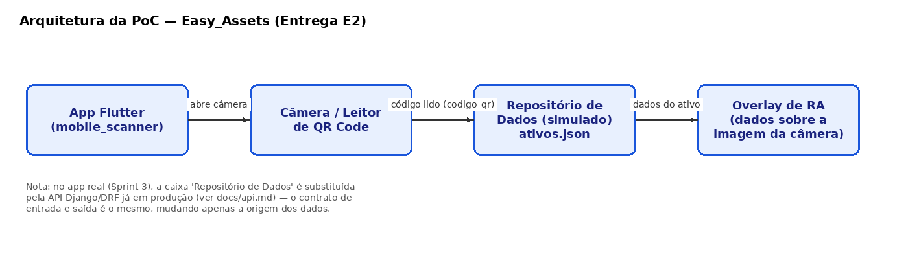

# Arquitetura da PoC — Easy_Assets (Entrega E2)

## Explicação do fluxo

O fluxo foi organizado em quatro componentes porque cada um representa uma
responsabilidade separada e testável isoladamente: o **App Flutter** cuida
só da interface e do ciclo de vida da câmera; o **Leitor de QR Code**
(pacote `mobile_scanner`) cuida só de decodificar o que a câmera enxerga,
devolvendo uma string; o **Repositório de Dados** cuida só de traduzir
essa string em um registro de ativo, sem saber nada sobre câmera ou tela;
e o **Overlay de RA** cuida só de desenhar esse resultado por cima da
imagem da câmera, sem saber de onde os dados vieram.

Essa separação é a mesma usada no sistema completo do Projeto Integrador:
na Sprint 3, a única caixa que muda é o "Repositório de Dados" — ela deixa
de ler um arquivo JSON local e passa a chamar a API real do backend
(Django + DRF, já em produção), mas o contrato de entrada (`codigo_qr`) e
saída (dados do ativo) permanece idêntico, documentado em
[`api.md`](api.md). Isso evita retrabalho: o código do scanner e do
overlay de RA não precisa mudar quando a fonte de dados mudar.
